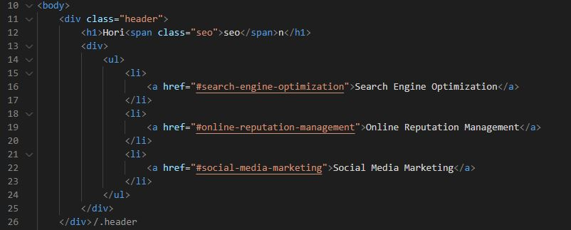
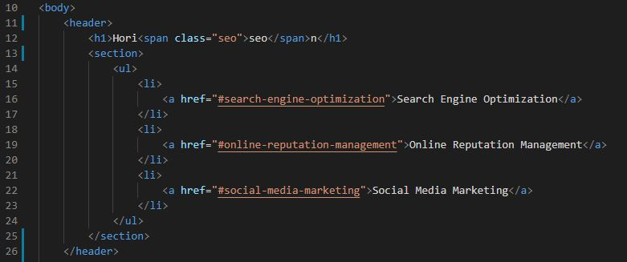
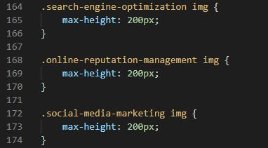
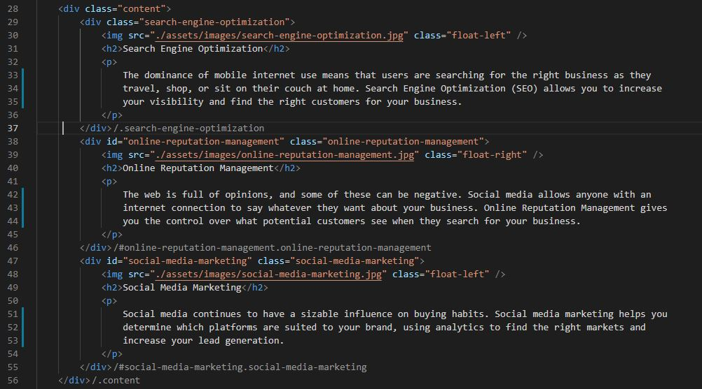
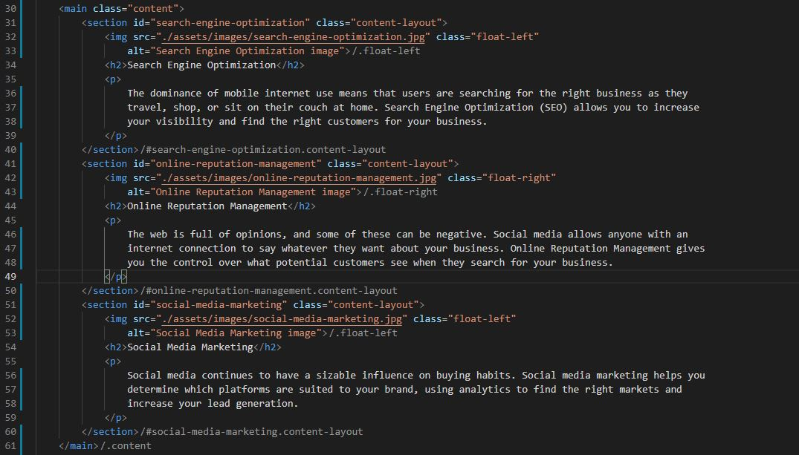

# HW1-Refactoring-and-Web-Accessibility

The purpose of this activity was to get a first sight of what code refactoring is and understanding the concept of web accessibility throught the use of tools such as the semantic elements.

The task was simple at first sight, analyzing a code that was given to us and understanding what it did in order to make small changes to improve the cleanliness, allowing both machines and programmers to get a better grasp of what each section of the code is and what it works for.

## Technologies

This project was developed using:
* CSS3
* HTML5

## Setup

To run this project clone this repository in a folder and open the html file, there is also a deployed webpage that shows the final version of the project, you can access it by opening the link at the end of this file

## Types of changes that were made

This activity had two main purposes, implemenenting semantic elements and improving the cleanliness of the coded by removing redundant elements.

The first part of this activity was achieved by identifying the core sections of the code in the html file and replacing the "div" tags with their proper semantic tag. An example can be seen in the following image.

|   |  |
| ------------- | ------------- |
| Code without semantic tags  | Code with semantic tags  |

&nbsp;

The latter was achieved by analyzing the css file and identifying the multiple classes that had the same attributes and belonged to the same parent class. After identifying the common elements, we stored the attributes in a new class that replaced the redundant one and implemented this class in the html code, this process can be seen in the following example

|   |  |
| ------------- | ------------- |
| CSS code with redundant classes  | CSS code without redundant classes  |

&nbsp;

|   |  |
| ------------- | ------------- |
| HTML code with redundant classes  | HTML code without redundant classes  |

&nbsp;

After implementing these changes, some other minor bugs were fixed such as a missing hyperlink in one of the attachments on the header as well as some pieces of code inside the css file that were were relocated to improve readability

## Known bugs

* Using an adblock can cause some images to not display properly

## Deployed webpage:
* https://erickcc.github.io/HW1-Refactoring-and-Web-Accessibility/
